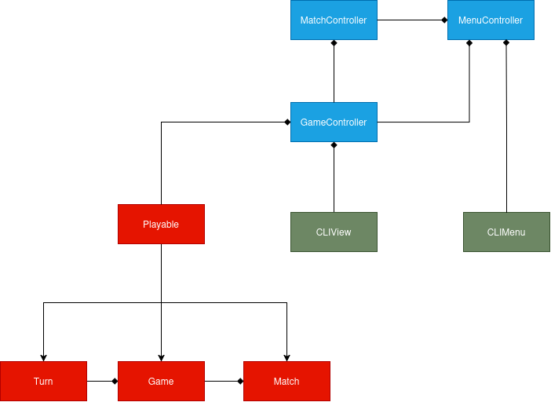

# Design architetturale

La struttura architetturale è stata individuata partendo dai requisiti funzionali e non funzionali definiti
durante la fase di analisi.
Si è cercato di realizzare un sistema estendibile, mantenibile, modulare, con nette separazioni di responsabilità.

## Struttura

## MVC

L'architettura è stata realizzata aderendo al pattern MVC (Model-View-Controller), che consente di
mantenere separate le sezioni dedite alla logica del sistema, la sua rappresentazione grafica, e il coordinamento
tra questi.
Nel contesto di questo progetto queste sezioni si occupano di:
- Model: gestisce i dati e la logica dell'applicazione, ovvero le carte, la loro suddivisione
  nel tavolo, l'esecuzione delle meccaniche di gioco, e il calcolo dei punteggi. È composto da:
  - `Turn`: mantiene le informazioni del tavolo (`Board`) e la mano del giocatore durante il suo turno, è responsabile
    dell'esecuzione delle meccaniche di gioco
  - `Game`: gestisce una singola partita concatenando turni e alternando i giocatori
  - `Match`: gestisce la modalità di gioco con punteggio massimo, permettendo di giocare piu' `Game` consecutivi
  - `Opponent`: gestisce la logica dell'avversario virtuale
- View: gestisce la rappresentazione dai dati all'utente e ne raccoglie l'input. È composto da:
  - `CLIMenu`: gestisce la rappresentazione grafica del menu iniziale dell'applicazione
  - `CLIView`: gestisce la rappresentazione grafica degli elementi del gioco
- Controller: gestisce la coordinazione tra View e Model. Ottiene gli input dell'utente dalla
  View, fornisce l'azione scelta dall'utente al Model, e comunica il nuovo stato del Model alla View. È composto da:
  - `GameController`: gestisce le interazioni con l'utente durante lo svolgimento di una partita
  - `MatchController`: gestisce le interazioni con l'utente durante lo svolgimento di un match
  - `MenuController`: gestisce le interazioni con l'utente durante la navigazione del menu principale

Questa struttura acconsente di raggiungere gli obiettivi di manutenibilità, modularità, ed estensibilità,
in quanto ogni sezione ha responsabilità ben separate dalle altre e puo' essere modificata in maniera
indipendente da esse.

---

1. [Processo di sviluppo](processo.md)
   1. [Sprint 1](process/sprint01.md)
   2. [Sprint 2](process/sprint02.md)
   3. [Sprint 3](process/sprint03.md)
2. [Requisiti](requisiti.md)
3. [Architettura](architettura.md)
4. [Design di dettaglio (prossimo)](design-di-dettaglio.md)
