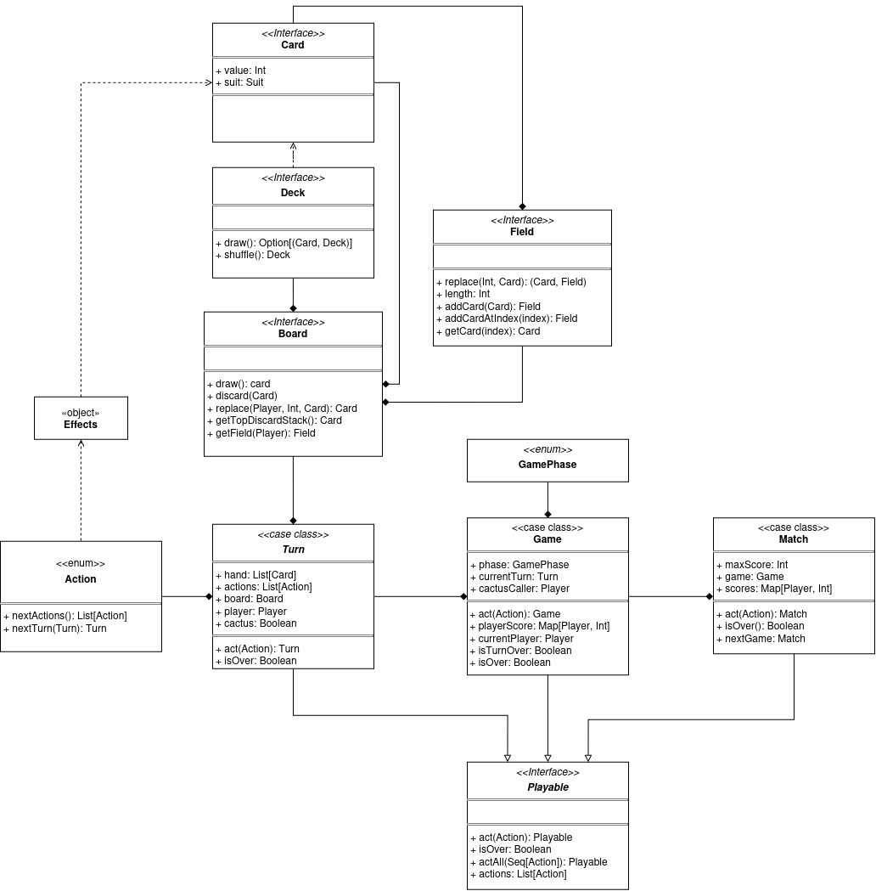
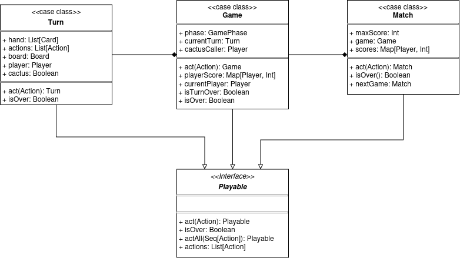
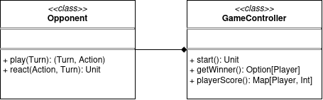
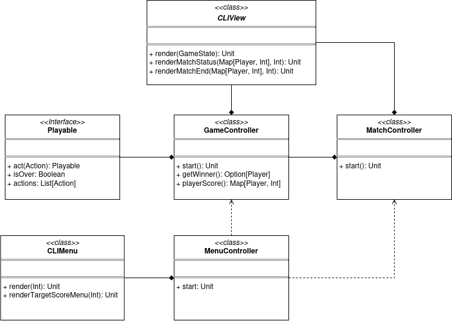
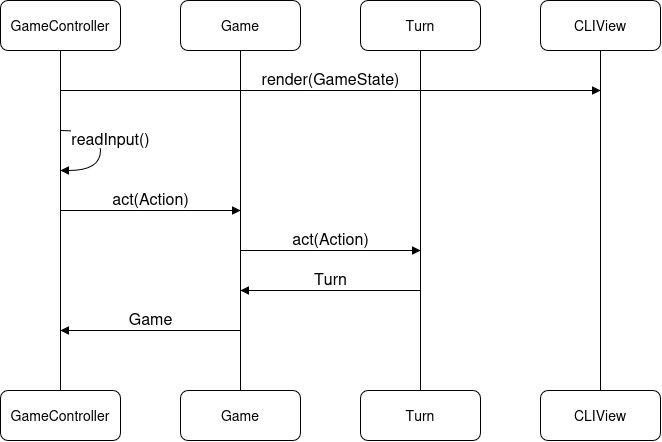
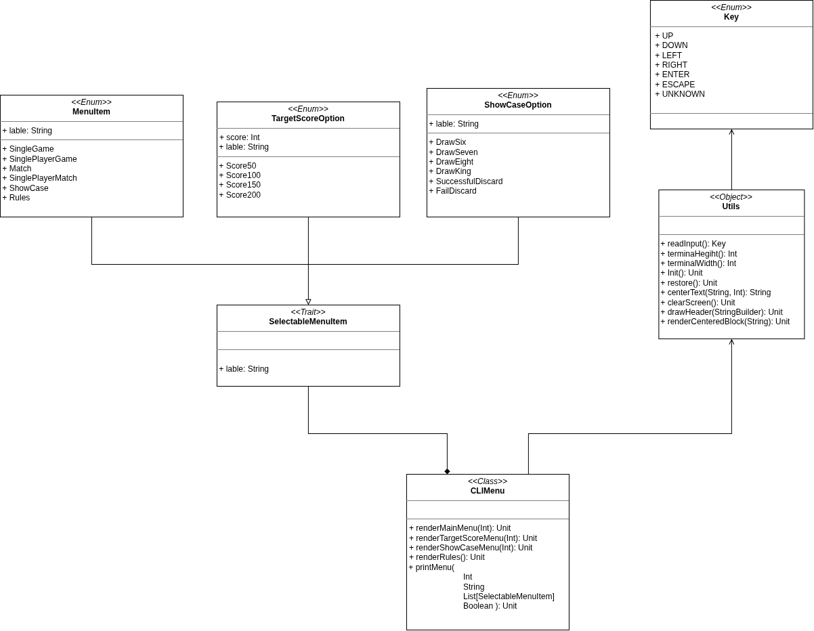
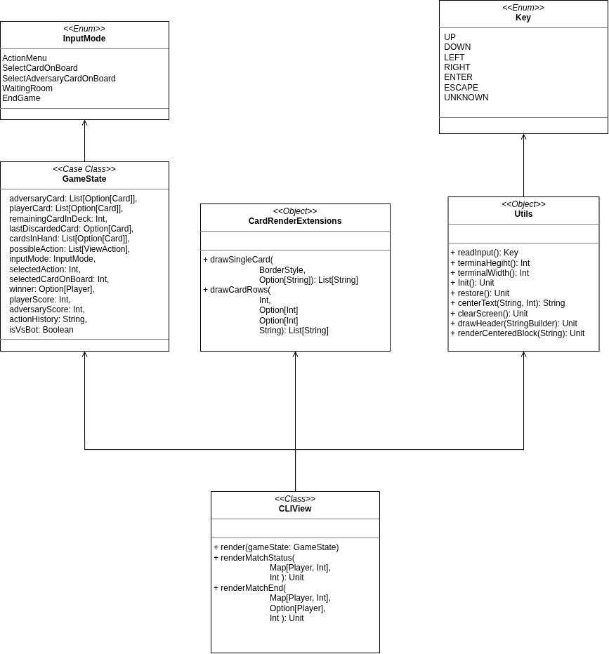

# Design di dettaglio

## Model

Gli elementi di model sono organizzati per composizione, l'entità piu'
elementare è `Card` che rappresenta una singola carta. I campi dei giocatori,
che sono composti da piu' carte, vengono rappresentati dall'entità `Field`.
L'entità `Deck` rappresenta il mazzo da cui i giocatori pescano a inizio turno.
L'entità `Board` rappresenta il tavolo di gioco, è responsabile del mantenimento
di tutte le informazioni inerenti alle carte durante tutte le fasi del gioco, e aggrega
tutte le entità nominate in precedenza in aggiunta alla pila degli scarti.
Le entità `Turn`, `Game`, e `Match`, organizzate a loro volta per composizione, gestiscono
rispettivamente un singolo turno, una partita composta da piu' turni, e un match composto da
piu' partite. Queste entità implementano l'interfaccia `Playable` tramite la quale è possibile
avanzare le fasi del gioco fornendo una delle azioni (`Action`) indicate dall'entità stessa.

## Board

L'interfaccia `Board` fornisce diversi metodi che permettono di modificare il tavolo durante
il turno. Questi metodi a loro volta sfruttano quelli forniti dalle interfacce `Field`, `Deck`, e
`Card` di cui `Board` è composta.

### Creazione del tavolo (`Board`, `Field`, `Deck`, `Card`)

La creazione delle entità `Board` avviene
tramite **Factory Methods** contenuti nell'oggetto `BoardFactory`.
Per facilitare e sintetizzare il loro utilizzo, soprattutto a scopo di testing,
è stato realizzato un DSL, che permette di popolare una `Board` indicando
quali carte inserire nei sui vari elementi. Il DSL comprende funzionalità per
la creazione dei sotto-elementi della `Board`, come le singole carte (`Card`), i campi
dei giocatori (`Field`), il mazzo (`Deck`), e la pila degli scarti.

### Playable

L'interfaccia `Playable` rappresenta le entità che racchiudono le funzionalità delle dinamiche
di gioco.
Attraverso di essa è possibile avanzare nelle varie fasi del gioco, cioè alterare lo stato
delle entità `Playable`, scegliendo una tra le azioni (`Action`) disponibili tramite il metodo
`act`.

L'entità base è `Turn` che rappresenta un singolo turno di un singolo giocatore, e
aggrega al suo interno il giocatore, la sua mano, e il tavolo (`Board`).
L'entità `Game` rappresenta un'intera partita composta da piu' turni, mentre `Match` rappresenta
una o piu' partite ed è composta da uno o piu' `Game`.

`Game` gestisce il progresso di una partita alternando i giocatori a ogni turno, generando
turni adeguati alla fase di gioco (`GamePhase`) in cui il turno avviene,
e calcolando il punteggio finale della partita.

`Match` gestisce il progresso di piu' partite durante un match con punteggio limite, accumulando
i punteggi delle partite.

### Opponent

L'entità `Opponent` gestisce il comportamento dell'avversario virtuale, essa è utilizzata da
`GameController` qualora l'utente selezioni l'opzione per giocatore singolo dal menu principale.
Le sue funzionalità principali sono i metodi `play` e `react`, che rappresentano rispettivamente
la capacità di selezionare autonomamente una tra le azioni disponibili in un turno in base
all'attuale conoscenza del tavolo di gioco, e la capacità di alterare questa conoscenza
in base alle azioni eseguite dall'utente durante il suo turno.

## Controller

L'interfaccia `Playable` è utilizzata da `GameController`, che ottiene l'input dell'utente 
e permette di selezionare l'azione desiderata durante il turno.
`MatchController` aggiunge la possibilità di giocare piu partite tramite composizione con `GameController`.
L'istanza del controller adeguato è creata da `MenuController` in base all'elemento selezionato dall'utente
nel menu.

Il loop principale eseguito durante una qualsiasi partita è il seguente:

## View

`CLIMenu` gestisce la rappresentazione degli elementi del menu principale, essi
sono istanze dell'interfaccia `SelectableMenuItem`.

`CLIView` gestisce la rappresentazione degli elementi del gioco durante lo svolgimento di
una partita.

---

1. [Processo di sviluppo](processo.md)
    1. [Sprint 1](process/sprint01.md)
    2. [Sprint 2](process/sprint02.md)
    3. [Sprint 3](process/sprint03.md)
2. [Requisiti](requisiti.md)
3. [Architettura](architettura.md)
4. [Design di dettaglio](design-di-dettaglio.md)
5. [**Implementazione (prossimo)**](implementazione.md)
6. [Testing](testing.md)
7. [Retrospettiva](retrospettiva.md)